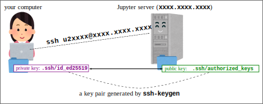

<link rel="stylesheet" href="../scripts/style.css">

# How to access Jupyter environment {.unnumbered}

# Login

* Go to <a href="https://utol.ecc.u-tokyo.ac.jp/" target="_blank" rel="noopener">UTOL</a> and open the course page.
* From the assignment list, find <font color=blue>"Assignment 0: Jupyter environment"</font> and check its <font color=blue>"Comments from the instructor"</font> (「教員からのコメント」). You do not need to submit anything for this assignment.

  * Note: If you cannot find the assignment, register for the course using the <font color=blue>"Register a course"</font> button in UTOL (see: <a href="https://utol.ecc.u-tokyo.ac.jp/common/manual/download?file=1" target="_blank" rel="noopener">UTOL User Manual for Students p. 28</a>).
  * Note: Registering for the course in UTOL does not mean you are officially enrolled. If you decide to enroll, do so via <a href="https://utas.adm.u-tokyo.ac.jp/" target="_blank" rel="noopener">UTAS</a>.
* In the "Comments from the instructor", find a message like: "Visit https://xxxx.xxxx.xxxx:xxxx/ and sign in with your UTokyo Account. Your username will be u2xxxx." Then visit the URL and sign in with your UTokyo Account.
* After signing in, check the browser address bar and confirm that you are on a URL like <font color=blue>https://xxxx.xxxx.xxxx:xxxx/user/u2xxxx/lab</font>, which matches your assigned username.
* If you see the error <font color=blue>403: Forbidden: cannot assign local user for xxxxxxxxxx@utac.u-tokyo.ac.jp</font>, it means your account is not ready yet. Make sure you have registered in UTOL (see above), and let the instructor know you are waiting.<br/><br/> <iframe width="560" height="315" src="https://www.youtube.com/embed/XMzz7jo9RzA?si=D39VS_mQYiEta3TW" title="YouTube video player" frameborder="0" allow="accelerometer; autoplay; clipboard-write; encrypted-media; gyroscope; picture-in-picture; web-share" referrerpolicy="strict-origin-when-cross-origin" allowfullscreen></iframe>

# Working with Nbgrader

## Fetching an Assignment

- We use [Nbgrader](https://nbgrader.readthedocs.io/en/stable/) to distribute files for assignments and exercises.
- After signing in to Jupyter, open <font color="blue">Nbgrader</font> -> <font color="blue">Assignment List</font> from the top menu to see a page like this.
  - When an assignment is available, you will see its name along with a <font color="blue">Fetch</font> button near the top of the page. Click the button to retrieve it.
  - Click ▶ to display the fetched files. Then click a notebook (a file ending with `.ipynb`) to open it.
  - Follow the instructions in the notebook.<br/><br/> <iframe width="560" height="315" src="https://www.youtube.com/embed/BNbM9nLqqLU?si=1e5V5nNCr9sU_tSx" title="YouTube video player" frameborder="0" allow="accelerometer; autoplay; clipboard-write; encrypted-media; gyroscope; picture-in-picture; web-share" referrerpolicy="strict-origin-when-cross-origin" allowfullscreen></iframe>  

## Note: <font color="red">Do not copy</font> existing cells

- Some cells are intended for entering your answers and are used for grading.
- If you duplicate (copy and paste) such a cell, the notebook may break and cannot be graded.
- If you need an extra cell that does not exist in the distributed notebook, create a new one instead (`a` to create above, `b` to create below, etc.), rather than copying an existing cell.

## Validate Notebook

- Clicking the <font color="blue">Validate</font> button near the top of a notebook or on the <font color="blue">Assignment List</font> page checks whether:
  - the notebook is not broken (e.g., answer cells are not duplicated), and
  - the cells have been modified at least slightly.
- Before submitting a notebook, validate it to ensure that it is not broken.
- Note: The <font color="blue">Validate</font> function may not always work reliably. Ask the instructor whether you should use it or ignore it.  
  <br/><br/>
  <iframe width="560" height="315" src="https://www.youtube.com/embed/eZQ1Z89VQRU?si=JzImqfRFxtH6vzjL" title="YouTube video player" frameborder="0" allow="accelerometer; autoplay; clipboard-write; encrypted-media; gyroscope; picture-in-picture; web-share" referrerpolicy="strict-origin-when-cross-origin" allowfullscreen></iframe>
  
## Submitting an Assignment

- To submit your work from a Jupyter notebook, go to <font color="blue">Nbgrader</font> -> <font color="blue">Assignment List</font> in the menu, and click the <font color="blue">Submit</font> button.
- Some notebooks are for self-learning and are not graded. You do not need to submit those notebooks.
- Assignments that are graded will always be clearly announced in <font color="blue">UTOL Assignments</font>. For such assignments, make sure to:
  - submit your work via Jupyter, and
  - report your submission in the corresponding UTOL assignment (e.g., just state that you have submitted it on Jupyter).
  - The actual content of your work is submitted via Jupyter.<br/><br/><iframe width="560" height="315" src="https://www.youtube.com/embed/b2BX6X2SgoQ?si=DBhMWDRZ6ghCbxSc" title="YouTube video player" frameborder="0" allow="accelerometer; autoplay; clipboard-write; encrypted-media; gyroscope; picture-in-picture; web-share" referrerpolicy="strict-origin-when-cross-origin" allowfullscreen></iframe>

# (Optional) A Few Jupyter Notebook Basics

- In this course, you do not need to become a master of Jupyter notebooks; you will mainly work with given notebooks by modifying and executing existing cells.
- However, knowing some basics will help you work more comfortably.
- <font color="blue">Create a new notebook</font>: open the "Launcher" tab (<font color="blue">+</font> in the tab bar) and click an appropriate button.

## Python Notebook

- This is the most common type of notebook in the Jupyter environment.
- In the Launcher tab, click <font color="blue">"Python 3 (ipykernel)"</font> in the Notebook section.
- <font color="blue">In a notebook</font>:
  - A new notebook initially contains a code cell.
  - Click inside a cell to edit it (_<font color=blue>edit mode</font>_).
  - Press `Esc` (or click outside the cell) to exit editing (_<font color=blue>command mode</font>_).
  - There are three types of cells: <font color="blue">code</font>, <font color="blue">markdown</font>, and raw. In this course, we use only code and markdown.
  - You can change the cell type using the toolbar at the top of the tab.
  - In a code cell:
    - Write Python code. Press SHIFT + ENTER to execute it.
    - Cells beginning with <font color=blue><tt>%%</tt></font> behave differently depending on the command; they may not contain Python code.
    - In particular, cells beginning with <font color=blue><tt>%%bash</tt></font> allow you to run shell commands.
  - In a markdown cell:
    - Write text. Press SHIFT + ENTER to render it.
  - In command mode:
    - <font color=blue><tt>a</tt></font> : create a cell above
    - <font color=blue><tt>b</tt></font> : create a cell below
    - <font color=blue><tt>dd</tt></font> : delete a cell
    - You can learn other shortcuts from the main menu.
  - To rename a notebook, right-click the tab.
  - To delete a notebook, open the file browser in the left pane, right-click the file, and choose "Delete".

<a name="bash_notebook"> </a>

## Bash Notebook

- This is a notebook for executing shell commands.
- Code cells should contain shell commands, not Python code.
- Otherwise, it is very similar to a Python notebook.
- A Python notebook can execute shell commands using `%%bash`, but an important difference is that each `%%bash` cell runs in a separate (fresh) shell. As a result, shell state (such as the current working directory or environment variables) does not persist across cells.
- In contrast, a Bash notebook communicates with a single shell for the entire session, so it behaves more like a traditional command-line environment, while still providing the recording and documentation features of Jupyter notebooks.

## Terminal

- This provides a terminal where you can execute shell commands.
- In the Launcher tab, click "Terminal" in the Other section.
- It is a standard command-line environment and does not create a notebook.


<a name="if_jupyter_goes_wrong"> </a>

# If Jupyter goes wrong ...

- Things can sometimes go wrong in Jupyter. It is important to know how to recover from such situations.
- A "soft" reset:
  - From the top menu, select <font color="blue">Kernel</font> -> <font color="blue">Restart Kernel</font> (or <font color="blue">Restart Kernel and Clear Output</font>).
- A "hard" reset (when nothing else works):
  - From the top menu, select <font color="blue">File</font> -> <font color="blue">Hub Control Panel</font>. Then click <font color="red">Stop My Server</font> and restart it by clicking <font color="blue">Start My Server</font>.
- Also, make sure to press `Ctrl-S` frequently to save your notebooks. Notebooks are saved automatically from time to time, but you should not rely on this.<br/><br/><iframe width="560" height="315" src="https://www.youtube.com/embed/j3HfHuIxADg?si=dZIUfR5PyH7cSqpF" title="YouTube video player" frameborder="0" allow="accelerometer; autoplay; clipboard-write; encrypted-media; gyroscope; picture-in-picture; web-share" referrerpolicy="strict-origin-when-cross-origin" allowfullscreen></iframe>


# I want to start over by re-fetching the assignment ...

- If you accidentally break your notebook or delete files and want to start over, rename the assignment folder and restart your Jupyter server by following the procedure in <a href="#if_jupyter_goes_wrong">If Jupyter goes wrong ...</a> above.
- Details:
  - In the left pane, open the file browser and navigate to the notebook directory. 
  - Right-click the folder for the assignment you want to restart and rename it (e.g., `pl00_intro` -&gt; `pl00_intro_xxx`).
  - Renaming a directory that contains open files may confuse the server, so perform a hard reset by following the procedure in <a href="#if_jupyter_goes_wrong">If Jupyter goes wrong ...</a>.
  - Open <font color="blue">Nbgrader</font> -&gt; <font color="blue">Assignment List</font> again, and you should be able to fetch the assignment.<br/><br/>
<iframe width="560" height="315" src="https://www.youtube.com/embed/QqE18GAT4S0?si=2VJNYg3JaQzJB3m7" title="YouTube video player" frameborder="0" allow="accelerometer; autoplay; clipboard-write; encrypted-media; gyroscope; picture-in-picture; web-share" referrerpolicy="strict-origin-when-cross-origin" allowfullscreen></iframe>

- Note: You can also perform these steps in a terminal (SSH or Jupyter Terminal). For example:

```
cd ~/notebooks/
mv pl00_intro pl00_intro_xxx
# Stop My Server -&gt; Start My Server
# re-fetch
# transplant the work you need
```

# I want to work with command line (SSH), not within Jupyter (web browser) ...

* Jupyter is great for distributing texts and sample programs and lightly editing them. 
* However, it is not an ideal environment for editing and writing programs. 
* You might want to use your favorite editors such as VSCode, Vim, or Emacs to edit programs.
* To do so, you need to be able to remote-login the server using SSH
* To remote-login with SSH, you need to set up the following state for public key authentication to work. That is, you have
  * SSH private key with a name like `.ssh/id_ed25519` in your machine
  * SSH public key with the name `.ssh/authorized_keys` in the Jupyter server<br/><br/>{width=70%}
* The filename (`id_ed25519`) depends on the crypto and it may be <tt>id_rsa, id_dsa</tt> etc.
* If you do not have a pair of private/public key, generate them on _your machine_ and upload the public key to the Jupyter server

## How to set up for SSH login

### A video for inpatients

* The video below covers steps explained in the following text<br/><br/><iframe width="560" height="315" src="https://www.youtube.com/embed/Yv10Ul3PIzY" title="YouTube video player" frameborder="0" allow="accelerometer; autoplay; clipboard-write; encrypted-media; gyroscope; picture-in-picture" allowfullscreen></iframe>

### Prepare an SSH key pair

* This step must be done _<font color=blue>ON YOUR COMPUTER</font>_ (probably your laptop, the machine from which you want to SSH the Jupyter)
* If an SSH key pair (`~/.ssh/id_ed25519` and `~/.ssh/id_ed25519.pub` or something similar, like `id_rsa` and `id_rsa.pub` etc.) already exist on your computer, you have a key pair and can skip this step
* How to check if you already have one: open the command line terminal in your computer and execute the following. 
```
your_computer$ cd ~/.ssh/
your_computer$ ls
id_ed25519 id_ed25519.pub
```
* Note: on Windows, use powershell instead of the legacy command prompt (cmd). Powershell has `ls` command but cmd doesn't, for example.
* If you see the above two files, among others, it means you already have a key pair
  * <font color="red">id_ed25519</font> is <font color="red">the private key</font>, and 
  * <font color="blue">id_ed25519.pub</font> (ends with .pub) <font color="blue">the public key</font>
* If you don't have a key pair, generate one by the following command
```
your_computer$ ssh-keygen
```
* If they already exist, this command asks if you want to overwrite them; you'd better NOT overwrite them

### Uploading public key to Jupyter server

* Once you have a key pair, the next step is to upload the public key on the Jupyter server
* In the left pane of the Jupyterlab, choose the home directory so `notebooks` is shown there. Click the Upload Files icon  right below the Jupyter menu to upload the public key file (<font color="blue">id_ed25519.pub</font> or something similar). You will have the file `id_ed25519.pub` under the server's home directory
* Execute the following commands on the Jupyter server (change `~/notebooks/id_ed25519.pub` below accordingly if the file name is different)
* To do so, you may want to use <a href="#bash_notebook">Bash notebook</a> or just `%%bash` cell in Python notebook
```
mkdir -p ~/.ssh/
cp ~/id_ed25519.pub ~/.ssh/authorized_keys
chmod 700 ~/.ssh
chmod 600 ~/.ssh/authorized_keys
```
* Execute the following to check
```
ls -ld ~/.ssh
ls -l ~/.ssh/authorized_keys
cat ~/.ssh/authorized_keys
```
* If you see something like this, you are all set!
```
drwx------ 2 u2xxxx u2xxxx 4096 Oct  4 22:19 /home/u2xxxx/.ssh
-rw------- 1 u2xxxx u2xxxx 394 Oct  4 22:19 /home/u2xxxx/.ssh/authorized_keys
ssh-ed25519 AAAAB3NzaC1yc2EAAAADAQABAAABAQC9s/2Uiy187pQvMNVwlNMRTSNFnvj9EVwOPx9/qLuiQg086zXFB2eugxTL1Pw+ViQ  ...  ... uB/TiOnA0e6KDpU2h4 
```
* The points to check are `drwx------` and `-rw-------` and whether the string in the last line looks like `ssh-ed25519 AAAAB3Nza ...`. If the last line looks like the following, it means the key format is wrong
* A key in a wrong format
```
=== BEGIN SSH2 PUBLIC KEY ===
gakjjkgdslkjgkljkjdakjdakljdkff
tuireuproeqiutreiurewuriouoweu0
      ...

=== END SSH2 PUBLIC KEY ===
```

### Checking if you are able to login with SSH
* From your machine's command line terminal, do
```
your_computer$ ssh u2xxxxx@server_name
```
* <font color="blue">u2xxxx</font> should be replaced with your user name _in the Jupyter environment_.  It is _DIFFERENT FROM_ your UTokyo Account.
* <font color="blue">server_name</font> should be replaced with the host name part of the URL (e.g., if the Juptyer URL is https://abc.def.org:8000/, it is `abc.def.org`)
* To know your user name in the Jupyter environment, execute the following on the Jupyter server
```
whoami
```
* If everything goes alright, you should see the server's command prompt
```
your_computer$ ssh u2xxxx@server_name
Welcome to Ubuntu 20.04.3 LTS (GNU/Linux 4.15.0-1054-aws x86_64)

 * Documentation:  https://help.ubuntu.com

   ..nn.

Last login: Sun Dec 15 16:29:26 2019 from 111.99.149.67
$ 
```
* Then you should be able to run any editor running within a terminal (emacs, vim, nano, etc.)
* All files distributed as part of assignments are in `notebook` directory right under your home directory.

# Using VSCode Remote Extension

* Using VSCode, you can edit remote files fetched into your Jupyter environment
* First make sure you are able to SSH-login to the Jupyter server
