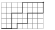
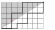

# Counting Shortest Grid Paths

1. Write a function `count_paths` (or `countPaths`) that takes two integers $a \ge 0$ and $b \ge 0$ and returns the number of shortest paths from $(0,0)$ to $(a,b)$ on a 2D grid.

* A shortest path:
  - consists only of moves to the right $(1,0)$ or up $(0,1)$,
  - and has exactly $(a + b)$ steps.
  
* Here is an illustration of two example shortest paths from $(0,0)$ to $(8,5)$

* Hint: consider the _last step_ of such a path.

- If the last step is from $(a-1, b)$, how many paths lead there?
- If the last step is from $(a, b-1)$, how many paths lead there?

2. Define a function `count_paths_below` (or `countPathsBelow`) that counts the number of shortest paths from $(0,0)$ to $(a,b)$ that _never go strictly above_ the straight line connecting $(0,0)$ and $(a,b)$.

* Here is an illustration; one of the shortest paths now does not qualify as it goes into the prohibited area

* Boilerplate source files `{go,jl,ml,rs}/count_paths.{go,jl,ml,rs}` containing the test code is generated and shown below.

* Edit the source files either by opening them in a text editor (e.g., vscode), or editing the cells below and executing them.
