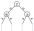
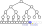
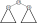
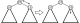

# Binary Heap

* Let's consider how to implement a binary heap, data structure used for heap sort.
* See [Wikipedia article](https://en.wikipedia.org/wiki/Binary_heap) for illustration.
* In a nutshell, 
	- each node, an internal node or a leaf, has a value 
	- **shape property:** it is a complete binary tree except some missing nodes in the rightmost leaves
     
 
    - **heap property:** if $p$ is a parent node and $c$ its child, $p$'s value $\le$ $c$'s value
     
	
* Due to the heap property, finding the minimum element in a binary heap is trivial (= the value at the root)
* The crux is how to _add a value_ to binary heap and _remove the minimum value_ from it efficiently, maintaining the shape/heap property

## Problem

* Define a data type representing a binary heap, called `binheap` (or `BinHeap`)
* Define two functions explained below
  * `binheap_add` (or `binHeapAdd`), which takes a non-negative integer $x$ and a binary heap $t$ and returns a new tree with $x$ added to $t$
  * `binheap_remove_min` (or `binHeapRemoveMin`), which takes a binary heap $t$ and returns a new tree with the minimum element (root) removed from $t$
* There are implicit conditions imposed by test code; specifically
  * In Go, use `nil` to represent a binary tree
  * In Julia, use `nothing` to represent a binary tree
  * In OCaml, use variant to define `binheap` and `Empty` to represent a binary tree
  * In Rust, use `enum` to define `BinHeap` and `Empty` (`BinHeap::Empty`) to represent a binary tree
* Check the test code before you proceed

* Note: Due to the shape property, the shape of a binary heap is uniquely determined solely by the number of nodes; if you imagine growing a tree by adding nodes one after another, the tree grows in the breadth-first and left-to-right order.
* Therefore, a binary heap could, and in fact often is, represented as an array of values of nodes in the breadth-first and left-to-right order.  Parent-child relationship is implicitly represented as arithmetic of indices; for a node $p$ at index $i$, its children are at index $2i+1$ and $2i+2$ (assuming 0-based arrays).
* This problem, however, does not use this representation for the purpose of exercising recursive data structure

## Adding a Value to a Binary Heap

Let's consider adding a value $x$ to a binary heap $t$

* If it is empty, return a leaf node whose value is $x$
* Otherwise, compare $x$ with the value at the root, $y$
   * Whichever is smaller should become the new root
   * Whichever is larger should descend the tree
   * But which way (left or right)? 
   * Note that the resulting shape is totally determined by the number of nodes due to the shape property
   * It means that where the _new node_ appears is determined by the current shape of the node, and you should descend toward that place. 
      

   * Specifically, 
      + (case A) if the left child is not a _complete binary tree_ (i.e., there are some missing nodes in it) $\rightarrow$ descend left
      + if the left child is a _complete binary tree (i.e., no missing nodes in it)_, 
	     + (case B) if the right child has the same number of nodes (i.e., $t$ is itself a complete binary tree), the new node should appear at the next level (leftmost position) $\rightarrow$ descend left
		 + (case C) otherwise, $\rightarrow$ descend right
   * Note that, to efficiently decide if it should descend to left or right, each node has to keep track of the number of nodes in each child

## Removing the Minimum Value from a Binary Heap

* Let's consider removing the minimum value (value at the root) from a binary heap $t$
* Again, the shape of the tree after removal is uniquely determined; the rightmost leaf node will be gone
   

* Therefore, we first get the value of the rightmost leaf node ($x$) and a new tree with the rightmost leaf node removed ($t'$)
* Given $x$ and $t'$, we create another new tree, with the root of $t'$ replaced with $x$, and place $x$ at the right place
* To that end, determine if $x$ should descend, and if it should, to left or right?
   * if $x$ is already smaller than the root of both left child and right child, no need descend
   

   * otherwise whichever is smaller than the root of left and the root of right should come to the root and $x$ should descend to the empty place which has been occupied by it
      

* Boilerplate source files `{go,jl,ml,rs}/binheap.{go,jl,ml,rs}` containing the test code is generated and shown below.
* Edit the source files either by opening them in a text editor (e.g., vscode), or editing the cells below and executing them.
